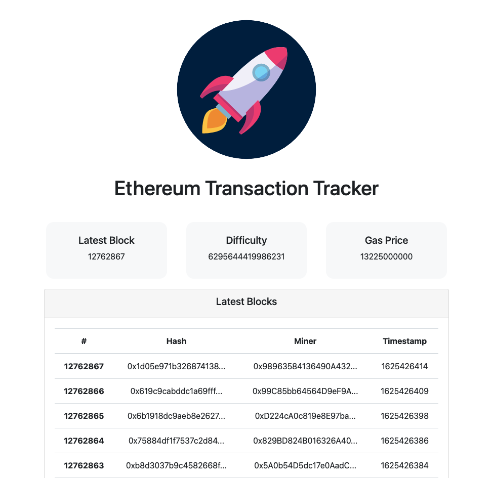

# Ethereum Blockchain Transaction Tracker
Website that tracks recent transactions on the Ethereum Blockchain

1. Open Terminal
2. $ git clone https://github.com/rkchan77/ETH-transaction-tracker
3. cd ETH-transaction-tracker
4. npm install
5. npm run start
6. Open localhost:3000 in your browser if application does not open automatically

Preview: 

